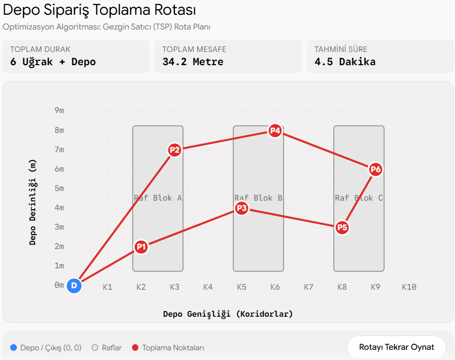

# 📦 Warehouse Order Picking Route Optimization (TSP)

A logistics and operations research project that models order picking within a multi-aisle warehouse as a Traveling Salesperson Problem (TSP) using Manhattan distance metrics and the Nearest Neighbor heuristic.

## 📌 Problem Formulation
Order picking accounts for over 50% of total warehouse operating costs. In standard multi-aisle warehouse environments, operators navigate rectilinear aisle configurations. This project calculates picking sequences to minimize total travel distance and idle transit time.

## 📊 Visualized Route Output

## 🚀 Features
- **Manhattan Rectilinear Distance:** Realistic modeling of 90-degree aisle movements.
- **Nearest Neighbor Heuristic:** Fast, scalable order sequencing algorithm.
- **Automated Route Plotting:** Visual representation of warehouse racks, pick coordinates, and directional flow vectors.

## 🛠️ Tech Stack
- Python 3.9+
- `matplotlib`, `numpy`
